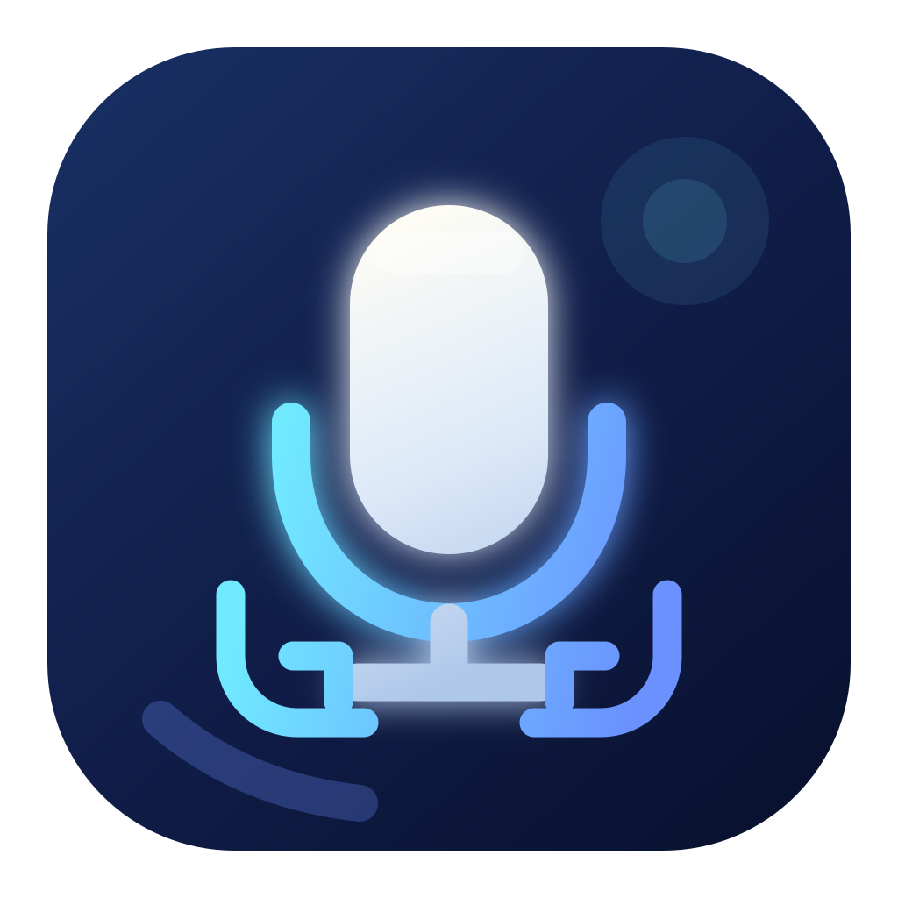
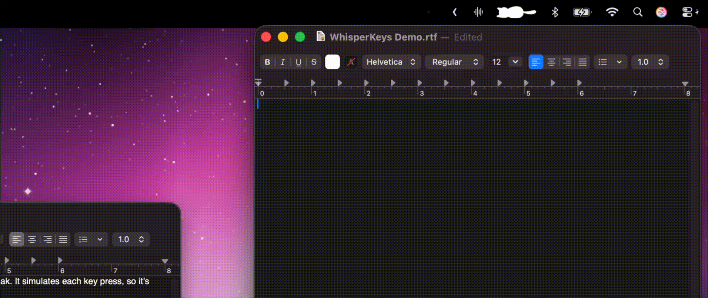

<div align="center">
  

  <h1><strong>WhisperKeys</strong></h1>

  <p><strong>Fast, private, on-device dictation for every app on your Mac.</strong></p>

  <p>
    WhisperKeys transcribes speech locally with WhisperKit, then types it into the
    focused app as real keyboard events—even across many virtual desktops and
    remote applications.
  </p>

  <p>
    <a href="https://github.com/j-sofia/WhisperKeys/releases/latest">
      
    </a>
    
    
    <a href="LICENSE">
      
    </a>
  </p>

  <p>
    <a href="https://github.com/j-sofia/WhisperKeys/stargazers">
      
    </a>
  </p>

  <p>
    <a href="#demo">Demo</a> ·
    <a href="#installation">Install</a> ·
    <a href="#features">Features</a> ·
    <a href="#development">Develop</a> ·
    <a href="CONTRIBUTING.md">Contribute</a>
  </p>
</div>

---

## Demo

<div align="center">
  
</div>

## Why WhisperKeys?

Most dictation apps paste a finished transcript. WhisperKeys sends individual
key-down and key-up events instead. This makes it especially useful in Windows
VMs, VNC sessions, enterprise remote-desktop clients, and other places where
clipboard sharing or normal text insertion may not work.

Everything is transcribed locally on your Mac. Your audio does not need to leave
the device for speech recognition.

## Features

- **Private by design** — transcription runs on-device with a local Whisper model.
- **Two dictation workflows** — type stable words live or review and edit the
  complete transcript before anything is typed.
- **Types anywhere** — sends normal keyboard events to the currently focused app
  instead of pasting text.
- **Remote-desktop friendly** — designed to work with apps that forward system
  keyboard input.
- **Keyboard-layout aware** — supports the active macOS layout, including Shift
  and Option characters.
- **Custom shortcuts** — record any key or key combination, then activate it with
  a single press, double press, or push-to-talk hold.
- **Configurable output** — adjust typing speed, key timing, capitalization, and
  whether Return is pressed after dictation.
- **Selectable microphone** — follow the current system input or pin dictation to
  a specific audio device.
- **Flexible models** — choose from Tiny through Large v3.
- **Native macOS experience** — runs from the menu bar, with optional launch at
  login, Dock visibility, and light, dark, or system appearance.

## Requirements

| | Requirement |
| --- | --- |
| **Operating system** | macOS 14 Sonoma or later |
| **Hardware** | Apple Silicon Mac |
| **Permissions** | Microphone and Accessibility; Input Monitoring for global shortcuts |
| **Development** | Xcode 16 or later |

## Installation

1. Download the latest `WhisperKeys.zip` from
   [GitHub Releases](https://github.com/j-sofia/WhisperKeys/releases/latest).
2. Double-click the ZIP and move `WhisperKeys.app` to `/Applications`.
3. Open WhisperKeys.
4. Choose a local model, select a shortcut, and grant the requested permissions.

> [!NOTE]
> A signed and notarized release opens normally. Only bypass Gatekeeper for a
> test build received directly from a developer you trust.

### Permissions

WhisperKeys requests only the macOS permissions needed for its core behavior:

- **Microphone** records audio for local transcription.
- **Accessibility** allows WhisperKeys to type into other apps.
- **Input Monitoring** enables the global double-tap shortcut.

If microphone access was previously denied, open **System Settings → Privacy &
Security → Microphone**, enable WhisperKeys, then choose **Refresh Permission
Status** in the app.

If WhisperKeys is missing from the Accessibility list, open **System Settings →
Privacy & Security → Accessibility**, click **+**, and add
`/Applications/WhisperKeys.app`.

## Usage

1. Open WhisperKeys from the menu bar.
2. Start dictation from the menu or use your configured shortcut.
3. Speak naturally into your Mac's microphone.
4. Stop with the menu, repeat the shortcut, or release it in push-to-talk mode.

In **Live mode**, WhisperKeys types stable text shared by consecutive hypotheses
and then finishes with a final accuracy pass. Revisions and long repeated tails
are held back instead of being typed.

In **Review before typing** mode, a floating panel shows the live transcript.
When dictation ends, you can accept it immediately or edit it first; WhisperKeys
restores focus to the original app before typing the accepted text.

Starting a new dictation cancels the current transcription and typing.

### Models

Models are stored in:

```text
~/Library/Application Support/WhisperKeys/Models
```

Use **Show Models Folder** in the app to open that location. If installation is
interrupted, choose **Install Selected Model** again; completed files are kept and
only stale partial downloads are cleared.

## How it works

```text
SwiftUI menu bar / settings
                 │
           AppViewModel (MVVM coordinator)
        ┌────────┼───────────┐
 AudioRecorder  WhisperKitSpeechRecognizer  GlobalShortcutMonitor
                       │
                  recognized String
                ┌──────┴──────┐
           Live mode      Review mode
                │         floating editor
                │              │ accept
                └──────┬───────┘
                       │
                 TypingEngine (serial background queue)
                       │ character at a time
                 KeyboardMapper (TIS + UCKeyTranslate)
                       │ KeyStroke(keycode, modifiers)
                 KeyEventEmitter (CGEvent down/up)
```

The typed text is sent one character at a time and mapped to the active macOS
keyboard layout. WhisperKeys does not use the clipboard, simulate `Cmd-V`, or
insert text through an Accessibility text field.

Modifier keys such as Shift are sent as separate down/up events before their
dependent characters. This is important for virtual desktops, which may not
honor a modifier flag attached only to a character event. Characters requiring
multi-key dead-key composition are reported as unsupported rather than inserted
as Unicode text.

### Microsoft Windows App

When Windows App (`com.microsoft.rdc.macos`) is focused, WhisperKeys keeps its
normal Core Graphics key-event transport and adds a small delay between key-down
and key-up transitions. This prevents remote clients from losing a rapid event
burst or leaving the final key held.

While connected, open **Connections → Keyboard Mode** and choose **Unicode**.
Unicode mode translates text using the local keyboard; Scancode mode is intended
for physical-key shortcuts and non-printing keys.

> [!IMPORTANT]
> Some remote clients may ignore synthetic keyboard events. The target app or
> client must accept system-level keyboard input.

## Development

1. Clone the repository:

   ```zsh
   git clone https://github.com/j-sofia/WhisperKeys.git
   cd WhisperKeys
   ```

2. Open `WhisperKeys.xcodeproj` in Xcode 16 or later.
3. Let Xcode resolve the `argmax-oss-swift` package and `WhisperKit` product.
4. Set a personal signing team and, if needed, replace
   `com.example.WhisperKeys` with your bundle identifier.
5. Build and run the **WhisperKeys** scheme on an Apple Silicon Mac running
   macOS 14 or later.

Run the test suite from Terminal:

```zsh
swift test
```

Verify the app target without code signing:

```zsh
xcodebuild \
  -project WhisperKeys.xcodeproj \
  -scheme WhisperKeys \
  -configuration Debug \
  -destination 'platform=macOS' \
  CODE_SIGNING_ALLOWED=NO \
  build
```

The app is intentionally not sandboxed because it posts keyboard events and
monitors the global shortcut. Keep the
`com.apple.security.device.audio-input` Hardened Runtime entitlement enabled so
macOS can request microphone access.

### Project structure

```text
App/           Application lifecycle
Views/         Menu, onboarding, and settings
ViewModels/    UI state, coordination, and debug log
Speech/        Recorder, model store, and WhisperKit backend
Typing/        Cancellable timing queue
Permissions/   macOS privacy permission status
Keyboard/      Layout mapping, event transport, and global shortcut
Settings/      Persisted user configuration
Models/        Shared view state and value types
Tests/         Unit tests
```

## Troubleshooting

<details>
<summary><strong>Microphone access is denied or missing</strong></summary>

Open **System Settings → Privacy & Security → Microphone**, enable WhisperKeys,
then return to the app and choose **Refresh Permission Status**.

</details>

<details>
<summary><strong>Accessibility or Input Monitoring is not working</strong></summary>

Use **Refresh Permission Decisions** in the app. This clears only WhisperKeys'
previous decisions, restarts the app, and returns to the permissions step.

</details>

<details>
<summary><strong>The microphone status says “Restricted by macOS”</strong></summary>

Screen Time or device-management controls are restricting the permission. Those
controls must be changed before WhisperKeys can record.

</details>

<details>
<summary><strong>A remote app produces garbled or repeated text</strong></summary>

Reduce the typing speed or increase key timing in WhisperKeys. For Microsoft
Windows App, also set **Connections → Keyboard Mode → Unicode**.

</details>

## Sharing and publishing builds

Do not send an unpackaged `.app` folder through chat, email, or cloud storage;
those services can alter bundle metadata or executable permissions. Package the
complete application instead:

```zsh
ditto -c -k --keepParent --sequesterRsrc \
  "/path/to/WhisperKeys.app" \
  "WhisperKeys.zip"
```

Public releases should be signed with a **Developer ID Application** certificate
and notarized by Apple. Verify an exported build before publishing:

```zsh
codesign --verify --deep --strict --verbose=2 "/path/to/WhisperKeys.app"
spctl --assess --type execute --verbose=4 "/path/to/WhisperKeys.app"
xcrun stapler validate "/path/to/WhisperKeys.app"
```

For one-off development builds, recipients may need to Control-click the app,
choose **Open**, and confirm the prompt. See Apple's warning before bypassing
Gatekeeper, and do so only for a copy received directly from a trusted developer.

## Contributing

Contributions are welcome. Please read [CONTRIBUTING.md](CONTRIBUTING.md) before
opening a pull request. For vulnerabilities, follow the private reporting
instructions in [SECURITY.md](SECURITY.md) instead of opening a public issue.

## License

WhisperKeys is available under the [MIT License](LICENSE).

---

<div align="center">
  <p>
    If WhisperKeys makes dictation easier for you,
    <a href="https://github.com/j-sofia/WhisperKeys/stargazers"><strong>give the project a star</strong></a>.
  </p>
</div>
